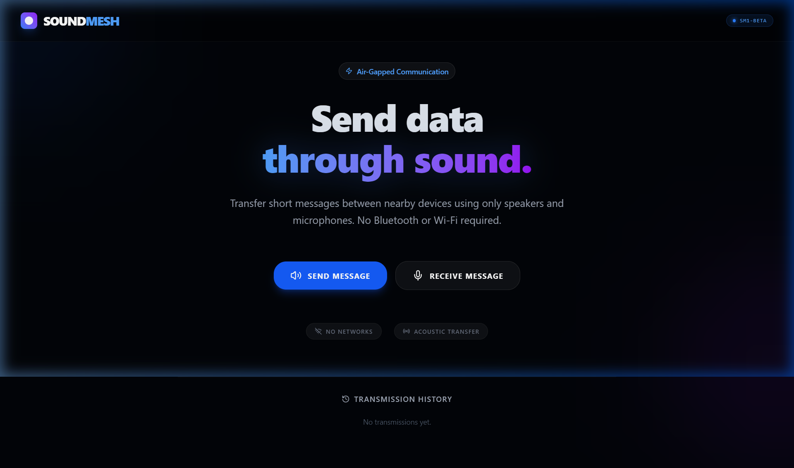
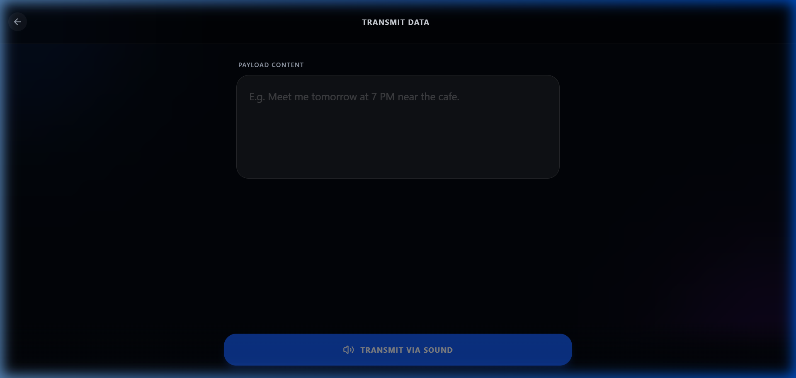
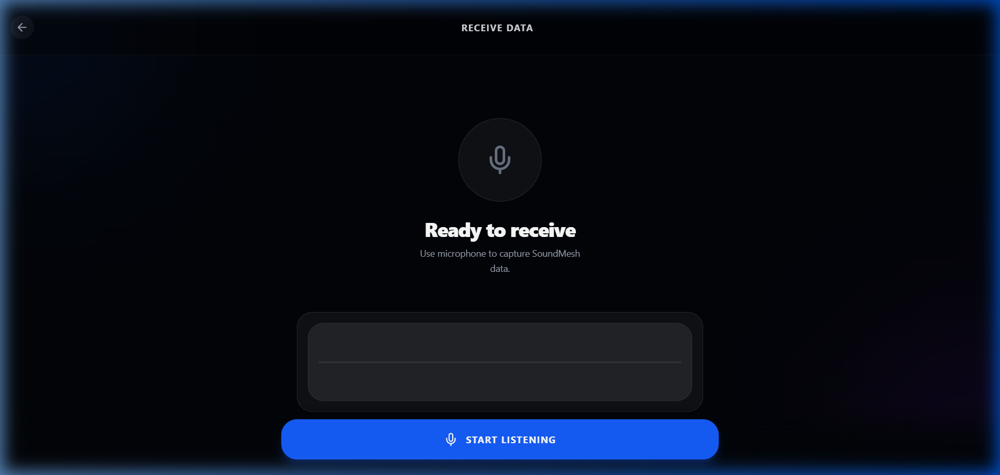
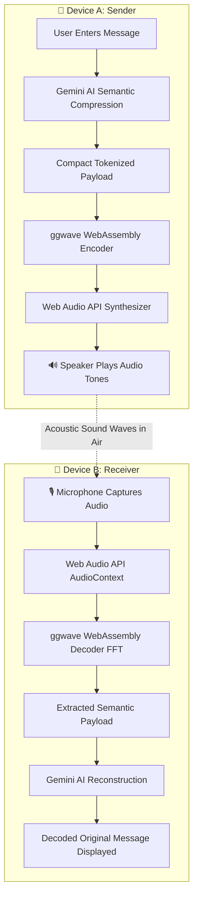

# 📡 SoundMesh — Air-Gapped Acoustic Data Transfer

<div align="center">

[](https://soundmesh-app.vercel.app/)
[](https://github.com/hasim2006/Soundmesh)
[](LICENSE)

<br />

[](https://react.dev/)
[](https://www.typescriptlang.org/)
[](https://vitejs.dev/)
[](https://tailwindcss.com/)
[](https://github.com/ggerganov/ggwave)
[](https://ai.google.dev/)

<p align="center">
  <b>Transfer data between nearby devices through SOUND — No Wi-Fi, No Bluetooth, No Cables.</b>
</p>

---

### 🌐 [Explore Live Application](https://soundmesh-app.vercel.app/)

</div>

<br />

<div align="center">
  
</div>

<br />

## 🌟 Overview

**SoundMesh** is an experimental air-gapped data transmission web application that transmits text messages across physical space using **audible acoustic sound waves**. 

By pairing the low-level digital signal processing of **[ggwave](https://github.com/ggerganov/ggwave)** (compiled to WebAssembly) with the semantic comprehension of **Google Gemini**, SoundMesh compresses natural human language into dense semantic tokens, broadcasts them as sound frequencies through a device's speaker, and reconstructs the original message through the microphone of a nearby receiving device.

> **Why Sound?** Sound travels across air gaps without pairing, passwords, network handshakes, or Bluetooth discovery. It is completely isolated from local network surveillance, RF jamming, or radio interface constraints.

---

## 📸 Interface Preview

<div align="center">

| 📤 Transmit Data | 📥 Receive Data |
| :---: | :---: |
|  |  |
| *Type natural message → Audio tones modulated* | *Microphone FFT capture → Instant decode* |

</div>

---

## ⚡ Key Features

- 🔊 **True Acoustic Data Transfer**: Utilizes Web Audio API and WebAssembly port of `ggwave` to encode payloads into frequency-shift keyed (FSK) audio pulses.
- 🧠 **Gemini AI Semantic Compression**: Shrinks verbose text into ultra-compact semantic representations (e.g. *"Meet me tomorrow at 7 PM near the cafe"* ➔ `MEET|TOMORROW|19:00|CAFE`) to fit small acoustic payloads.
- ✨ **Gemini AI Reconstruction**: Re-expands received compact acoustic tokens back into fluent, natural language sentences.
- 🎙️ **Real-Time Microphone Receiver**: Continuous audio stream analysis with FFT tone detection, filtering ambient noise and decoding incoming SoundMesh frames.
- 📊 **Dynamic Audio Waveform Visualizer**: Real-time canvas visualizer rendering live audio frequency bars and transmission amplitude.
- 📜 **Transmission History**: Local storage log of all outgoing and incoming acoustic transmissions with status flags.
- 🛡️ **Air-Gapped & Private**: No peer-to-peer Wi-Fi network, cellular data, or Bluetooth connection needed between transmitting devices.
- 📱 **Cross-Platform Responsive UI**: Sleek dark-mode aesthetic built with Tailwind CSS v4, Motion animations, and Lucide icons.

---

## 🔬 How It Works (Architecture)



### Transmission Pipeline:
1. **Input & Compression**: User inputs a message. The Gemini API condenses it to maximize acoustic transmission speed and reliability.
2. **Audio Modulation**: `ggwave` converts the compressed payload into multi-frequency acoustic tones (Fast Audible protocol).
3. **Air-Gap Broadcast**: Device A emits audible frequencies through its loudspeaker.
4. **Capture & Demodulation**: Device B's microphone samples the ambient sound buffer and passes audio samples to the `ggwave` WebAssembly decoder.
5. **Reconstruction**: The decoded tokens are interpreted and reconstituted into full natural language.

---

## 🛠️ Technology Stack

| Component | Technology | Description |
| :--- | :--- | :--- |
| **Frontend Framework** | [React 19](https://react.dev/) | High-performance UI rendering |
| **Build Tooling** | [Vite 6](https://vitejs.dev/) | Instant HMR and modern bundler |
| **Styling** | [Tailwind CSS v4](https://tailwindcss.com/) | Cutting-edge utility-first styling |
| **Animations** | [Motion](https://motion.dev/) | Smooth declarative layout animations |
| **Acoustic DSP** | [ggwave](https://github.com/ggerganov/ggwave) | WebAssembly data-over-sound engine |
| **Artificial Intelligence** | [Google Gemini API](https://ai.google.dev/) | `@google/genai` for semantic compression |
| **Icons** | [Lucide React](https://lucide.dev/) | Modern clean icon set |
| **Backend & Serving** | Express & Node.js | Local development & static asset serving |
| **Deployment** | [Vercel](https://vercel.com/) | Serverless cloud hosting |

---

## 🚀 Quick Start Guide

### Prerequisites
- [Node.js](https://nodejs.org/) (version 18 or higher)
- `npm`, `pnpm`, or `yarn`
- A free [Google AI Studio Gemini API Key](https://aistudio.google.com/app/apikey)

### 1. Clone the Repository
```bash
git clone https://github.com/hasim2006/Soundmesh.git
cd Soundmesh
```

### 2. Install Dependencies
```bash
npm install
```

### 3. Setup Environment Variables
Create a `.env` file from `.env.example`:
```bash
cp .env.example .env
```
Open `.env` and add your Google Gemini API key:
```env
GEMINI_API_KEY="your_actual_gemini_api_key_here"
```

### 4. Start Development Server
```bash
npm run dev
```
Open your browser at `http://localhost:3000`.

---

## 🧪 Device-to-Device Testing Guide

To experience actual air-gapped acoustic transmission between two devices:

1. **Open on Two Devices**:
   - Access the deployed web application on two devices (e.g. Laptop & Smartphone or two phones):
     👉 **[https://soundmesh-app.vercel.app/](https://soundmesh-app.vercel.app/)**
   - *Note on Local Testing:* Browsers require **HTTPS** (or `localhost`) to grant microphone access (`getUserMedia`). For local cross-device testing, use a tunnel like `ngrok` or Cloudflare Tunnel:
     ```bash
     npx ngrok http 3000
     ```

2. **Setup Device B (Receiver)**:
   - Tap **RECEIVE MESSAGE**.
   - Grant microphone permissions when prompted.
   - Tap **START LISTENING**.

3. **Setup Device A (Transmitter)**:
   - Tap **SEND MESSAGE**.
   - Enter your message in the payload field (e.g., `"Meet at 7 PM near the cafe"`).
   - Ensure the volume on Device A is turned up.
   - Tap **TRANSMIT VIA SOUND**.

4. **Observe the Transfer**:
   - Device A will play a distinct sequence of acoustic tones.
   - Device B's waveform visualizer will register the incoming signal and decode the message in real time!

---

## 📂 Project Structure

```plaintext
Soundmesh/
├── docs/
│   └── images/                 # High-resolution screenshots for README
│       ├── soundmesh-hero.png
│       ├── soundmesh-transmit.png
│       └── soundmesh-receive.png
├── src/
│   ├── audio/                  # Acoustic DSP & ggwave integrations
│   │   ├── ggwaveManager.ts    # WebAssembly loader & context
│   │   ├── ggwaveEncoder.ts    # Sound frequency audio modulation
│   │   ├── ggwaveDecoder.ts    # Microphone FFT audio demodulation
│   │   └── wavExport.ts        # Audio buffer utilities
│   ├── components/             # Reusable UI components
│   │   └── AudioWaveform.tsx   # Real-time audio canvas visualizer
│   ├── pages/                  # Application views
│   │   ├── LandingPage.tsx     # Hero & view selector
│   │   ├── SendPage.tsx        # Message composition & audio broadcast
│   │   ├── ReceivePage.tsx     # Microphone receiver & decoder
│   │   └── HistoryPage.tsx     # Transmission audit log
│   ├── App.tsx                 # Root component & navigation
│   ├── main.tsx                # React DOM entrypoint
│   └── index.css               # Global Tailwind styles
├── public/                     # Static public assets
├── .env.example                # Example environment variables
├── .gitignore                  # Git exclusions
├── metadata.json               # Application capabilities manifest
├── package.json                # Project dependencies and scripts
├── server.ts                   # Express server & Vite development middleware
├── tsconfig.json               # TypeScript configuration
├── vercel.json                 # Vercel deployment routing configuration
└── vite.config.ts              # Vite bundler configuration
```

---

## ⚙️ Available Scripts

| Command | Description |
| :--- | :--- |
| `npm run dev` | Starts the Express server with Vite middleware in development mode |
| `npm run build` | Builds the production Vite bundle and bundles `server.ts` |
| `npm run start` | Runs the compiled production server (`dist/server.cjs`) |
| `npm run lint` | Runs TypeScript type checking without emitting files |
| `npm run clean` | Removes build directories and temporary outputs |

---

## 💡 Performance & Reliability Tips

- **Sufficient Volume**: Set the sending device's speaker volume to **60% - 80%** for clear acoustic signal clarity.
- **Proximity**: Keep devices within **0.5 to 3 meters** of each other for optimal signal-to-noise ratio.
- **Background Noise**: Avoid testing in extremely loud environments with loud speech or clattering cutlery.
- **Payload Length**: Short, concise messages transfer faster and with higher fidelity. Enable Gemini semantic compression for longer texts.

---

## 📄 License

This project is licensed under the [Apache License 2.0](LICENSE).

---

<div align="center">
  <b>Built with ❤️ by <a href="https://github.com/hasim2006">hasim2006</a></b>
  <br />
  <sub>Powered by WebAssembly, Web Audio API, and Google Gemini</sub>
</div>
